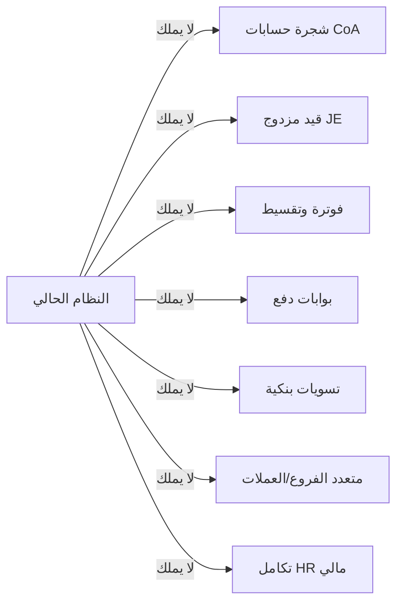
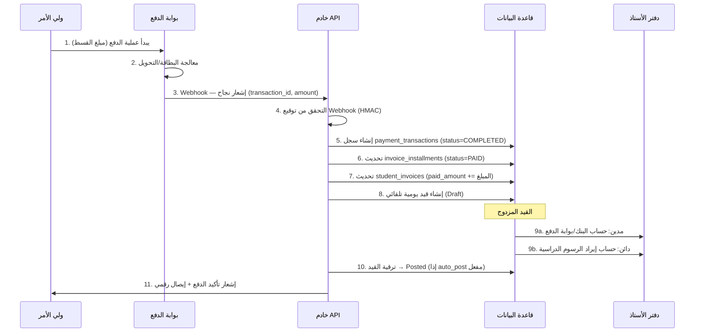
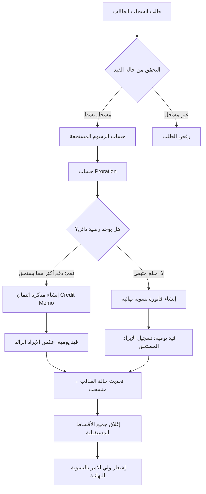

# 🏛️ التحليل والتصميم المعماري الشامل — النظام المالي المتقدم (Advanced Finance)

## نظام القيد المزدوج (Double-Entry Accounting) لنظام ERP المدرسي

---

**الإصدار:** 3.0 | **التاريخ:** 2026-03-02 | **المعماري:** عماد الجماعي  
**قاعدة البيانات:** MySQL 8.0+ | **الحالة:** مسودة تصميم للمراجعة

---

## 📑 فهرس الوثيقة

| #   | القسم                         | الملف                                                                |
| --- | ----------------------------- | -------------------------------------------------------------------- |
| 1   | هيكلية قاعدة البيانات (DDL)   | [advanced_finance_ddl.sql](./advanced_finance_ddl.sql)               |
| 2   | تدفق البيانات ومنطق الأعمال   | هذا الملف — القسم الثاني                                             |
| 3   | خطة التكامل (Integration API) | [advanced_finance_integration.md](./advanced_finance_integration.md) |
| 4   | خطة التنفيذ المرحلية          | [advanced_finance_phases.md](./advanced_finance_phases.md)           |

---

## 🔍 تحليل الوضع الراهن (Current State Analysis)

### البنية الحالية المتوفرة

| النظام               | الجداول                                    | الحالة   | نقاط القوة                     | الفجوات                                         |
| -------------------- | ------------------------------------------ | -------- | ------------------------------ | ----------------------------------------------- |
| البنية المشتركة (01) | users, roles, permissions, RBAC            | ✅ إنتاج | صلاحيات هرمية + مباشرة + تدقيق | لا يوجد module خاص بالمالية المتقدمة            |
| الطلاب (04)          | students, guardians, enrollments, siblings | ✅ إنتاج | ربط عائلي، حالة القيد          | لا يوجد ربط مالي مباشر بالحساب                  |
| المالي الحالي (07)   | funds, revenues, expenses, contributions   | ✅ إنتاج | صناديق، تصنيفات، مساهمات       | **لا يوجد قيد مزدوج، لا شجرة حسابات، لا فوترة** |
| الموارد البشرية (03) | employees, attendance, evaluations         | ✅ إنتاج | بيانات شاملة                   | لا يوجد ربط رواتب بالمحاسبة                     |
| النقل (09)           | buses, routes, subscriptions               | ✅ إنتاج | اشتراكات برسوم شهرية           | `monthly_fee` غير مربوط بنظام فوترة             |

### الفجوات الحرجة المطلوب سدها



---

## 📐 القسم الثاني: تدفق البيانات ومنطق الأعمال

### السيناريو 1: دفع ولي أمر قسط دراسي عبر بوابة دفع إلكترونية



#### الخطوات التفصيلية:

| الخطوة | العملية        | الجدول المتأثر                            | التفصيل                                                  |
| ------ | -------------- | ----------------------------------------- | -------------------------------------------------------- |
| 1      | بدء الدفع      | `payment_transactions`                    | إنشاء سجل `status='PENDING'`, `gateway_id`, `amount`     |
| 2      | معالجة البوابة | —                                         | البوابة تعالج البطاقة وترسل Webhook                      |
| 3      | استلام Webhook | `payment_transactions`                    | تحديث `gateway_transaction_id`, `status='COMPLETED'`     |
| 4      | التحقق الأمني  | —                                         | مطابقة HMAC signature مع المفتاح السري                   |
| 5      | ربط بالقسط     | `invoice_installments`                    | تحديث `paid_amount`, `payment_date`, `status='PAID'`     |
| 6      | تحديث الفاتورة | `student_invoices`                        | `paid_amount += المبلغ`, حساب `balance_due`              |
| 7      | إنشاء القيد    | `journal_entries` + `journal_entry_lines` | **مدين**: `1101-بنك/بوابة` ← **دائن**: `4001-إيراد رسوم` |
| 8      | الترحيل        | `journal_entries`                         | `status = 'POSTED'`, تحديث أرصدة `accounts`              |
| 9      | الإشعار        | `notifications`                           | إرسال SMS/Push لولي الأمر بتأكيد الدفع                   |

#### قاعدة القيد المزدوج المطبقة:

```sql
-- القيد التلقائي عند نجاح الدفع الإلكتروني
INSERT INTO journal_entries (reference_type, reference_id, description, status, fiscal_year_id)
VALUES ('PAYMENT', @payment_id, 'سداد قسط دراسي - بوابة إلكترونية', 'POSTED', @year_id);

-- سطر مدين: زيادة النقدية
INSERT INTO journal_entry_lines (journal_entry_id, account_id, debit_amount, credit_amount)
VALUES (@je_id, @bank_account_id, @amount, 0.00);

-- سطر دائن: تسجيل الإيراد
INSERT INTO journal_entry_lines (journal_entry_id, account_id, debit_amount, credit_amount)
VALUES (@je_id, @tuition_revenue_id, 0.00, @amount);

-- التحقق: مجموع المدين = مجموع الدائن (CONSTRAINT مطبق على مستوى الجدول)
```

---

### السيناريو 2: انسحاب طالب في منتصف الفصل (Proration/التسوية)



#### آلية حساب التسوية النسبية (Proration):

```
المتغيرات:
  - total_semester_days = عدد أيام الفصل الكلي (من calendar_master)
  - attended_days = عدد الأيام من بداية الفصل حتى تاريخ الانسحاب
  - total_fee = إجمالي الرسوم الفصلية
  - proration_ratio = attended_days / total_semester_days
  - earned_fee = total_fee × proration_ratio
  - already_paid = مجموع المدفوعات الفعلية

  إذا (already_paid > earned_fee):
    refund_amount = already_paid - earned_fee
    → إنشاء Credit Memo + قيد عكس إيراد
    → مدين: حساب إيراد الرسوم | دائن: حساب ولي الأمر/مستحقات الاسترداد

  إذا (already_paid < earned_fee):
    due_amount = earned_fee - already_paid
    → إنشاء فاتورة تسوية نهائية
    → مدين: ذمم مدينة (والد) | دائن: إيراد رسوم
```

#### مثال عملي:

| البند                    | القيمة                           |
| ------------------------ | -------------------------------- |
| رسوم الفصل الكلية        | 50,000 ريال                      |
| مدة الفصل                | 120 يوم                          |
| أيام الحضور حتى الانسحاب | 45 يوم                           |
| نسبة الاستحقاق           | 45/120 = **37.5%**               |
| الرسوم المستحقة          | 50,000 × 0.375 = **18,750 ريال** |
| المدفوع فعلياً (3 أقساط) | 25,000 ريال                      |
| **المبلغ المسترد**       | 25,000 - 18,750 = **6,250 ريال** |

#### القيود المحاسبية للاسترداد:

```sql
-- قيد 1: عكس الإيراد الزائد
-- مدين: إيراد الرسوم الدراسية  6,250
-- دائن: مستحقات الاسترداد       6,250

-- قيد 2: عند صرف المبلغ فعلياً
-- مدين: مستحقات الاسترداد  6,250
-- دائن: البنك/النقدية       6,250
```

---

> [!IMPORTANT]
> **الملفات المكملة لهذه الوثيقة:**
>
> - 📄 [DDL كامل — هيكلية قاعدة البيانات](./advanced_finance_ddl.sql)
> - 📄 [خطة التكامل — API Endpoints](./advanced_finance_integration.md)
> - 📄 [خطة التنفيذ المرحلية — 4 Sprints](./advanced_finance_phases.md)

---

**شركة إنما سوفت للحلول التقنية (InmaSoft)** | 2026
