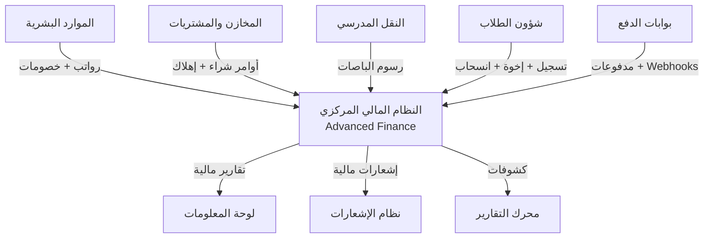

# 🔗 خطة التكامل — Integration Architecture

## واجهات برمجة التطبيقات (API Endpoints) للنظام المالي المتقدم

---

## الهيكل العام للتكامل



---

## 1️⃣ تكامل الموارد البشرية (HR → Finance)

### غرض التكامل

توليد قيود الرواتب والخصومات آلياً في نهاية كل شهر.

### API Endpoints

| Method | Endpoint                                     | الوصف                | المدخلات                                        | المخرجات                                               |
| ------ | -------------------------------------------- | -------------------- | ----------------------------------------------- | ------------------------------------------------------ |
| `POST` | `/api/v1/finance/hr/payroll-journal`         | توليد قيد رواتب شهري | `{month, year, branch_id}`                      | `{journal_entry_id, total_salaries, total_deductions}` |
| `GET`  | `/api/v1/finance/hr/payroll-summary/{month}` | ملخص الرواتب         | `month, year`                                   | `{gross, net, deductions_breakdown[]}`                 |
| `POST` | `/api/v1/finance/hr/deduction-journal`       | قيد خصم فردي         | `{employee_id, amount, reason, deduction_type}` | `{journal_entry_id}`                                   |
| `GET`  | `/api/v1/finance/hr/employee-balance/{id}`   | رصيد الموظف المالي   | `employee_id`                                   | `{advances, deductions, net_due}`                      |

### تدفق قيد الرواتب الشهري

```
1. نظام HR يحسب → إجمالي الرواتب + الخصومات + الصافي
2. POST /payroll-journal يُنشئ:
   القيد المزدوج:
   ├── مدين: 5001 (مصروف الرواتب) ← إجمالي الرواتب
   ├── دائن: 2102 (رواتب مستحقة) ← صافي الرواتب
   └── دائن: 1104 (ذمم موظفين) ← الخصومات (سلف/غياب)
3. عند الصرف الفعلي:
   ├── مدين: 2102 (رواتب مستحقة) ← المبلغ المصروف
   └── دائن: 1101 (البنك/النقدية) ← المبلغ المصروف
```

---

## 2️⃣ تكامل المخازن والمشتريات (Inventory/Procurement → Finance)

### API Endpoints

| Method | Endpoint                                          | الوصف           | المدخلات                              | المخرجات                                 |
| ------ | ------------------------------------------------- | --------------- | ------------------------------------- | ---------------------------------------- |
| `POST` | `/api/v1/finance/procurement/purchase-journal`    | قيد أمر شراء    | `{po_id, vendor_id, items[], total}`  | `{journal_entry_id}`                     |
| `POST` | `/api/v1/finance/procurement/payment-journal`     | قيد دفع مورد    | `{vendor_id, amount, payment_method}` | `{journal_entry_id, transaction_id}`     |
| `POST` | `/api/v1/finance/assets/depreciation-journal`     | قيد إهلاك دوري  | `{asset_category, period, method}`    | `{journal_entry_id, total_depreciation}` |
| `POST` | `/api/v1/finance/inventory/adjustment-journal`    | قيد تسوية مخزون | `{items[], adjustment_type}`          | `{journal_entry_id}`                     |
| `GET`  | `/api/v1/finance/procurement/vendor-balance/{id}` | رصيد المورد     | `vendor_id`                           | `{total_due, payments[], invoices[]}`    |

### تدفق قيد أمر الشراء

```
1. المخازن تُصدر أمر شراء (PO) → POST /purchase-journal
2. القيد التلقائي:
   ├── مدين: 5004 (مصروف مشتريات) ← قيمة البضاعة
   ├── مدين: 2104 (ضريبة مدخلات) ← VAT إن وجد
   └── دائن: 2101 (ذمم دائنة - موردون) ← الإجمالي
3. عند الدفع → POST /payment-journal:
   ├── مدين: 2101 (ذمم دائنة) ← المبلغ المدفوع
   └── دائن: 1101 (البنك) ← المبلغ المدفوع
```

### تدفق قيد الإهلاك

```
POST /depreciation-journal (شهري/سنوي):
├── مدين: 5005 (مصروف الإهلاك)
└── دائن: 1203 (مجمع الإهلاك)
* يدعم طريقة القسط الثابت (Straight Line) والقسط المتناقص
```

---

## 3️⃣ تكامل النقل المدرسي (Transport → Finance)

### API Endpoints

| Method | Endpoint                                        | الوصف                      | المدخلات                        | المخرجات                                  |
| ------ | ----------------------------------------------- | -------------------------- | ------------------------------- | ----------------------------------------- |
| `POST` | `/api/v1/finance/transport/generate-invoices`   | توليد فواتير النقل الشهرية | `{month, year, route_ids[]}`    | `{invoices_created, total_amount}`        |
| `POST` | `/api/v1/finance/transport/subscription-fee`    | ربط رسوم اشتراك بحساب طالب | `{subscription_id, fee_amount}` | `{invoice_line_id}`                       |
| `GET`  | `/api/v1/finance/transport/revenue-report`      | تقرير إيرادات النقل        | `{from_date, to_date}`          | `{total_revenue, by_route[], by_grade[]}` |
| `POST` | `/api/v1/finance/transport/maintenance-expense` | قيد مصروف صيانة باص        | `{maintenance_id, cost}`        | `{journal_entry_id}`                      |

### تدفق ربط رسوم النقل

```
1. اشتراك طالب (bus_subscriptions.monthly_fee) →
2. POST /generate-invoices يُنشئ:
   ├── invoice_line_item (fee_type='TRANSPORT', account_id=4003)
   └── القيد عند الدفع:
       ├── مدين: 1101 (النقدية) ← المبلغ
       └── دائن: 4003 (إيراد رسوم النقل) ← المبلغ
3. صيانة الباصات → POST /maintenance-expense:
   ├── مدين: 5003 (مصروف الوقود والنقل) ← التكلفة
   └── دائن: 1101 (النقدية/البنك) ← التكلفة
```

---

## 4️⃣ تكامل شؤون الطلاب (SIS → Finance)

### API Endpoints

| Method | Endpoint                                               | الوصف                           |
| ------ | ------------------------------------------------------ | ------------------------------- |
| `POST` | `/api/v1/finance/billing/generate-student-invoice`     | توليد فاتورة لطالب عند التسجيل  |
| `POST` | `/api/v1/finance/billing/apply-sibling-discount`       | تطبيق خصم الإخوة آلياً          |
| `POST` | `/api/v1/finance/billing/process-withdrawal`           | معالجة انسحاب طالب (Proration)  |
| `GET`  | `/api/v1/finance/billing/student-statement/{id}`       | كشف حساب الطالب الكامل          |
| `GET`  | `/api/v1/finance/billing/family-balance/{guardian_id}` | رصيد العائلة الكامل             |
| `POST` | `/api/v1/finance/billing/bulk-generate`                | توليد فواتير جماعية (بداية فصل) |

### محرك خصم الإخوة (Sibling Discount Engine)

```
المدخل: student_id من SIS
1. استعلام student_siblings → عدد الإخوة المسجلين حالياً
2. استعلام discount_rules WHERE discount_type='SIBLING'
3. الحساب:
   - الأخ الأول: 0% خصم
   - الأخ الثاني: حسب القاعدة (مثلاً 10%)
   - الأخ الثالث فما فوق: حسب القاعدة (مثلاً 20%)
4. تطبيق الخصم على invoice_line_items.discount_amount
5. قيد: مدين: 5007 (مصروف خصومات) | دائن: 4001 (إيراد رسوم)
```

---

## 5️⃣ بوابات الدفع (Payment Gateways → Finance)

### Webhook Endpoints

| Method | Endpoint                           | الوصف            |
| ------ | ---------------------------------- | ---------------- |
| `POST` | `/api/v1/webhooks/payment/success` | إشعار نجاح الدفع |
| `POST` | `/api/v1/webhooks/payment/failure` | إشعار فشل الدفع  |
| `POST` | `/api/v1/webhooks/payment/refund`  | إشعار استرداد    |

### أمان Webhooks

```
1. التحقق من HMAC-SHA256 في Header
2. التحقق من IP البوابة (Whitelist)
3. Idempotency Key لمنع التكرار
4. تسجيل كل Webhook في audit_log
```

---

## 6️⃣ واجهات مشتركة (Shared Finance APIs)

| Method | Endpoint                                   | الوصف               |
| ------ | ------------------------------------------ | ------------------- |
| `GET`  | `/api/v1/finance/accounts/tree`            | شجرة الحسابات كاملة |
| `POST` | `/api/v1/finance/journal/create`           | إنشاء قيد يدوي      |
| `PUT`  | `/api/v1/finance/journal/{id}/approve`     | اعتماد قيد          |
| `PUT`  | `/api/v1/finance/journal/{id}/post`        | ترحيل قيد           |
| `POST` | `/api/v1/finance/journal/{id}/reverse`     | عكس قيد مع السبب    |
| `GET`  | `/api/v1/finance/reports/trial-balance`    | ميزان المراجعة      |
| `GET`  | `/api/v1/finance/reports/general-ledger`   | دفتر الأستاذ        |
| `GET`  | `/api/v1/finance/reports/income-statement` | قائمة الدخل         |
| `GET`  | `/api/v1/finance/reports/balance-sheet`    | الميزانية العمومية  |
| `GET`  | `/api/v1/finance/reports/vat-report`       | التقرير الضريبي     |

---

**شركة إنما سوفت للحلول التقنية (InmaSoft)** | 2026
