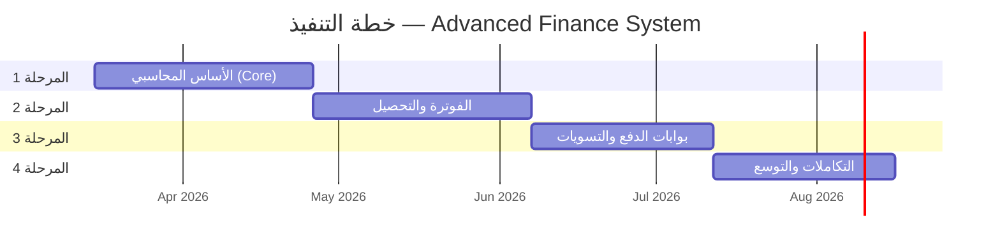
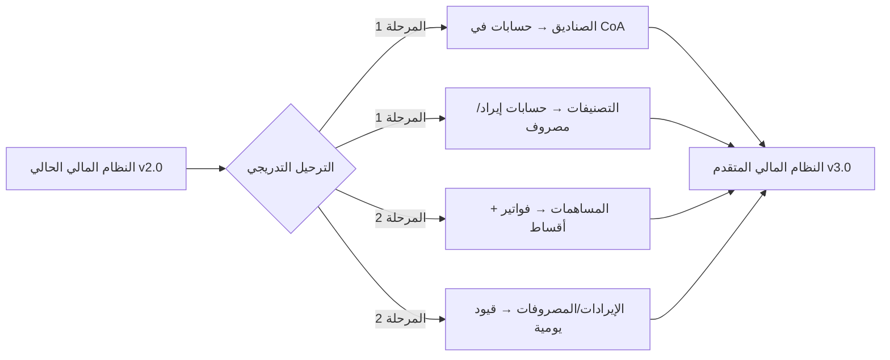

# 📋 خطة التنفيذ المرحلية — Phased Implementation Plan

## ترقية النظام المالي إلى Advanced Finance (4 مراحل Agile)

---

> [!IMPORTANT]
> **المبدأ الأساسي:** لا يتم تعطيل النظام الحالي أثناء الترقية. كل مرحلة تعمل بشكل مستقل وتتكامل تدريجياً.

---

## نظرة عامة على المراحل



| المرحلة                         | المدة    | البداية    | الانتهاء   | المخاطرة  |
| ------------------------------- | -------- | ---------- | ---------- | --------- |
| **Sprint 1**: الأساس المحاسبي   | 6 أسابيع | الأسبوع 1  | الأسبوع 6  | 🟢 منخفضة |
| **Sprint 2**: الفوترة والتحصيل  | 6 أسابيع | الأسبوع 7  | الأسبوع 12 | 🟡 متوسطة |
| **Sprint 3**: بوابات الدفع      | 5 أسابيع | الأسبوع 13 | الأسبوع 17 | 🔴 عالية  |
| **Sprint 4**: التكاملات والتوسع | 5 أسابيع | الأسبوع 18 | الأسبوع 22 | 🟡 متوسطة |

---

## 🟢 المرحلة 1: الأساس المحاسبي (Core Accounting Foundation)

**المدة:** 6 أسابيع | **الأولوية:** حرجة

### الأهداف

- إنشاء البنية التحتية المحاسبية بدون المساس بالنظام الحالي
- بناء شجرة الحسابات ونظام القيد المزدوج
- ربط السنة المالية بالعام الدراسي

### المخرجات التفصيلية

| الأسبوع | المهمة                     | الجدول/المكون                                       | معيار القبول                               |
| ------- | -------------------------- | --------------------------------------------------- | ------------------------------------------ |
| 1       | إنشاء جداول البنية التحتية | `branches`, `currencies`, `currency_exchange_rates` | DDL ينفذ بنجاح، بذور البيانات محملة        |
| 1-2     | إنشاء السنة المالية        | `fiscal_years`                                      | ربط مع `academic_years` يعمل               |
| 2-3     | بناء شجرة الحسابات         | `chart_of_accounts` + Seeds                         | 36 حساب أساسي، العلاقات الشجرية سليمة      |
| 3-4     | نظام القيد المزدوج         | `journal_entries` + `journal_entry_lines`           | CHECK constraint يمنع عدم التوازن          |
| 4-5     | دورة اعتماد القيود         | Logic: Draft → Approved → Posted                    | الانتقال بين الحالات يعمل، الصلاحيات مطبقة |
| 5       | آلية عكس القيود            | Reversal Logic                                      | العكس ينشئ قيد معاكس + يسجل السبب          |
| 5-6     | تقارير GL + ميزان المراجعة | `v_general_ledger`, `v_trial_balance`               | التقارير تعكس القيود المرحّلة فقط          |
| 6       | إضافة صلاحيات مالية        | `permissions` (insert)                              | `finance.*` permissions مضافة للنظام       |

### شروط الانتقال للمرحلة 2

- [x] جميع الجداول الأساسية تعمل
- [x] قيد يدوي يمكن إنشاؤه واعتماده وترحيله
- [x] ميزان المراجعة متوازن دائماً
- [x] النظام الحالي (07) لا يتأثر

---

## 🟡 المرحلة 2: الفوترة والتحصيل (Billing & Fees Engine)

**المدة:** 6 أسابيع | **الأولوية:** عالية

### الأهداف

- بناء نظام الفوترة والأقساط
- ربط الرسوم بأنواعها (دراسية، نقل، زي)
- تفعيل محرك الخصومات الآلي

### المخرجات التفصيلية

| الأسبوع | المهمة              | الجدول/المكون                             | معيار القبول                                |
| ------- | ------------------- | ----------------------------------------- | ------------------------------------------- |
| 7       | هياكل الرسوم        | `fee_structures`                          | تعريف رسوم لكل مرحلة ونوع                   |
| 7-8     | قواعد الخصم         | `discount_rules`                          | خصم الإخوة يعمل آلياً من `student_siblings` |
| 8-9     | الفواتير            | `student_invoices` + `invoice_line_items` | فاتورة تحتوي على بنود متعددة الأنواع        |
| 9-10    | خطط التقسيط         | `invoice_installments`                    | 1-12 قسط لكل فاتورة، تواريخ استحقاق         |
| 10-11   | كشف حساب الطالب     | `v_student_account_statement`             | يعرض الفواتير + المدفوعات + الرصيد          |
| 11      | توليد فواتير جماعية | `sp_generate_bulk_invoices`               | توليد فواتير لكل الطلاب عند بداية الفصل     |
| 12      | إعدادات الضرائب     | `tax_configurations`                      | VAT يحتسب تلقائياً على البنود               |

### ربط مع النظام الحالي

```
community_contributions (النظام الحالي)
    ↓ يبقى يعمل كما هو
    ↓ + يُولّد قيد يومية تلقائي عبر Trigger
    ↓ في journal_entries (النظام الجديد)
```

### شروط الانتقال للمرحلة 3

- [x] فاتورة طالب تُصدر بنجاح مع أقساط
- [x] خصم الإخوة يُحتسب تلقائياً
- [x] كشف حساب الطالب يعرض كل العمليات

---

## 🔴 المرحلة 3: بوابات الدفع والتسويات (Payment & Reconciliation)

**المدة:** 5 أسابيع | **الأولوية:** عالية | **المخاطرة:** عالية

### الأهداف

- دمج بوابات الدفع الإلكتروني والدفع المباشر
- بناء نظام التسويات البنكية
- إنشاء القيود التلقائية عند كل عملية دفع

### المخرجات التفصيلية

| الأسبوع | المهمة              | الجدول/المكون                                  | معيار القبول                         |
| ------- | ------------------- | ---------------------------------------------- | ------------------------------------ |
| 13      | بوابات الدفع        | `payment_gateways`                             | 3 بوابات (نقدي، بنكي، إلكتروني)      |
| 13-14   | معاملات الدفع       | `payment_transactions`                         | تسجيل كل عملية مع حالتها             |
| 14-15   | Webhook Integration | Webhook endpoints                              | استلام إشعارات البوابة + التحقق HMAC |
| 15      | القيود التلقائية    | Auto JE on payment                             | كل دفع ناجح ← قيد مزدوج تلقائي       |
| 15-16   | التسويات البنكية    | `bank_reconciliation` + `reconciliation_items` | مطابقة كشف البنك مع الدفاتر          |
| 16-17   | الإيصالات الرقمية   | Receipt generation                             | إيصال PDF/رقمي لكل عملية دفع         |
| 17      | اختبار End-to-End   | Full payment flow test                         | دفع → قيد → تسوية → تقرير            |

### إدارة المخاطر

| المخاطرة     | الاحتمال | التأثير | خطة التخفيف                             |
| ------------ | -------- | ------- | --------------------------------------- |
| فشل Webhook  | مرتفع    | عالي    | Retry queue + Dead letter + تسوية يدوية |
| دفع مكرر     | متوسط    | عالي    | Idempotency key على مستوى البوابة       |
| تأخر التسوية | متوسط    | متوسط   | تقرير يومي بالمعاملات غير المسواة       |
| اختراق أمني  | منخفض    | حرج     | HMAC, IP whitelist, PCI compliance      |

---

## 🟡 المرحلة 4: التكاملات والتوسع (Integrations & Scalability)

**المدة:** 5 أسابيع | **الأولوية:** متوسطة-عالية

### الأهداف

- تكامل HR (الرواتب) + المخازن + النقل مع النظام المالي
- دعم Multi-Branch الكامل
- معالجة حالة انسحاب الطالب (Proration)

### المخرجات التفصيلية

| الأسبوع | المهمة                    | المكون                                       | معيار القبول                       |
| ------- | ------------------------- | -------------------------------------------- | ---------------------------------- |
| 18      | تكامل HR - الرواتب        | `/api/v1/finance/hr/payroll-journal`         | قيد رواتب شهري يُولَّد آلياً       |
| 18-19   | تكامل HR - الخصومات       | `/api/v1/finance/hr/deduction-journal`       | خصم ← قيد محاسبي فوري              |
| 19      | تكامل المشتريات           | `/api/v1/finance/procurement/*`              | أمر شراء ← قيد ← دفع مورد          |
| 19-20   | تكامل المخازن             | Inventory adjustment                         | تسوية مخزون + إهلاك أصول           |
| 20      | تكامل النقل               | `/api/v1/finance/transport/*`                | رسوم باص ← بند فاتورة طالب ← قيد   |
| 20-21   | معالجة الانسحاب           | `/api/v1/finance/billing/process-withdrawal` | Proration + Credit Memo + قيد عكسي |
| 21      | Multi-Branch filtering    | Branch-aware queries                         | كل تقرير يدعم فلترة بالفرع         |
| 21-22   | التقارير النهائية         | Income Statement, Balance Sheet              | قائمة الدخل + الميزانية العمومية   |
| 22      | الاختبار الشامل + التوثيق | Full system testing                          | جميع السيناريوهات تعمل E2E         |

### خطة الترحيل من النظام القديم (Migration)



#### خطوات الترحيل:

1. **الصناديق (`financial_funds`)** → إنشاء حسابات مقابلة في `chart_of_accounts`
2. **التصنيفات (`financial_categories`)** → ربطها بحسابات الإيراد/المصروف
3. **الإيرادات (`revenues`)** → تحويلها إلى قيود يومية تاريخية
4. **المصروفات (`expenses`)** → تحويلها إلى قيود يومية تاريخية
5. **المساهمات (`community_contributions`)** → إنشاء فواتير بأثر رجعي
6. **التشغيل المتوازي** لمدة فصل دراسي كامل قبل إيقاف النظام القديم

---

## 📊 ملخص الجداول الجديدة حسب المرحلة

| المرحلة     | الجداول الجديدة                                                                                                                    | الـ Views                             |
| ----------- | ---------------------------------------------------------------------------------------------------------------------------------- | ------------------------------------- |
| Sprint 1    | `branches`, `currencies`, `currency_exchange_rates`, `fiscal_years`, `chart_of_accounts`, `journal_entries`, `journal_entry_lines` | `v_general_ledger`, `v_trial_balance` |
| Sprint 2    | `fee_structures`, `discount_rules`, `student_invoices`, `invoice_line_items`, `invoice_installments`, `tax_configurations`         | `v_student_account_statement`         |
| Sprint 3    | `payment_gateways`, `payment_transactions`, `bank_reconciliation`, `reconciliation_items`                                          | —                                     |
| Sprint 4    | — (API layer + migration)                                                                                                          | Income Statement, Balance Sheet       |
| **المجموع** | **18 جدول**                                                                                                                        | **5 Views**                           |

---

## ✅ معايير النجاح الكلية

| المعيار                     | الهدف      | القياس                            |
| --------------------------- | ---------- | --------------------------------- |
| **التوازن المحاسبي**        | 100%       | ميزان المراجعة متوازن دائماً      |
| **سرعة القيد التلقائي**     | < 500ms    | من استلام Webhook إلى ترحيل القيد |
| **دقة التسوية**             | > 95%      | نسبة المطابقة الآلية في التسويات  |
| **استمرارية النظام الحالي** | 0 downtime | لا يتعطل النظام الحالي أبداً      |
| **تغطية الاختبارات**        | > 80%      | Unit + Integration tests          |

---

**شركة إنما سوفت للحلول التقنية (InmaSoft)** | 2026
