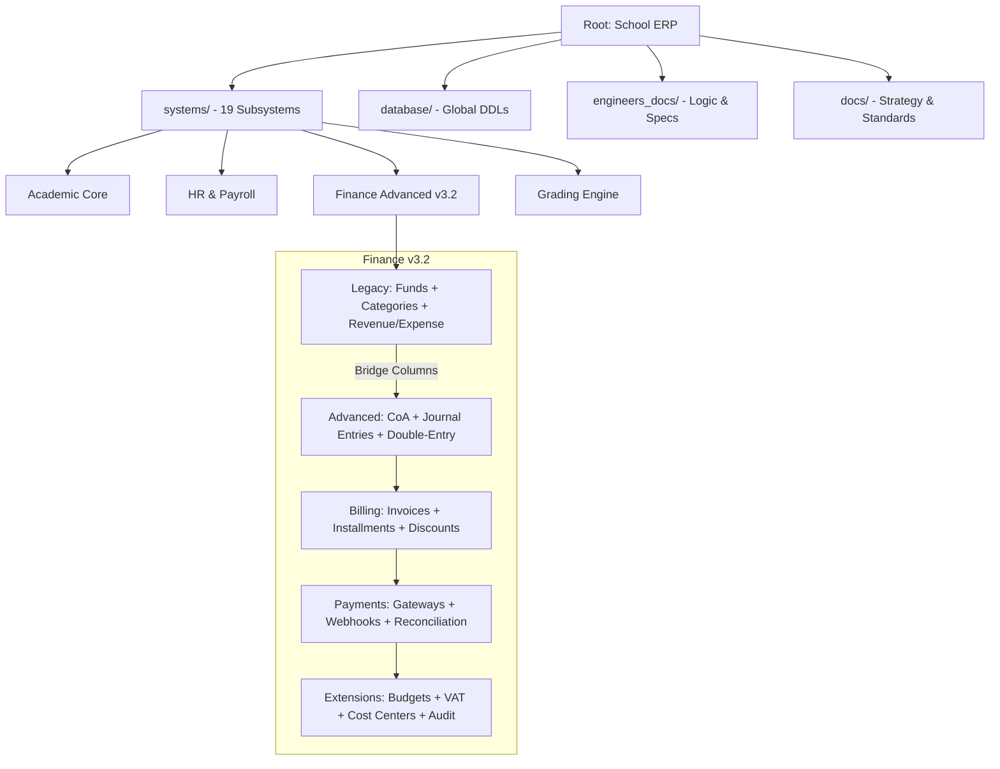
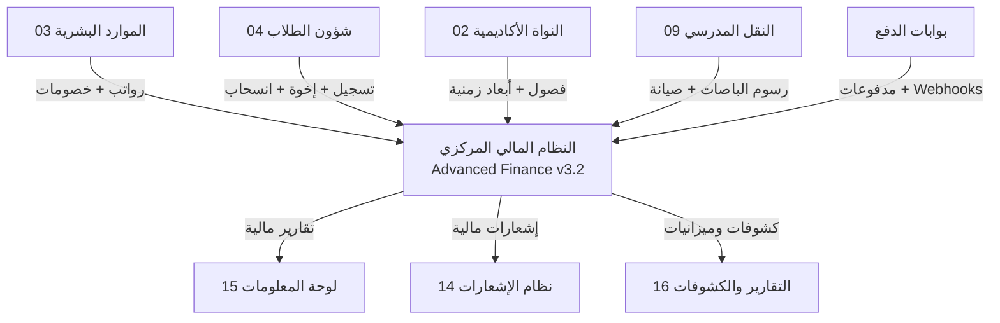

# 🏫 نظام إدارة المدرسة المتكامل (Integrated Educational ERP)

---

## 🌟 الرؤية والأهداف (Vision & Goals)
يمثل هذا المشروع **نظام تخطيط موارد تعليمي (ERP)** متكامل، مصمم لرقمنة كافة العمليات الأكاديمية والإدارية والمالية في المؤسسات التعليمية الحديثة. لا يقتصر النظام على حفظ البيانات، بل يعمل كمحرك ذكي لصنع القرار، وتتبع الأداء، وتعزيز الشفافية بين الإدارة والموظفين وأولياء الأمور.

---

## 🚀 الركائز الأساسية للنظام (Core Pillars)

### 🛡️ الحوكمة والتدقيق (Governance & Audit)
نظام صارم لتتبع كافة التغييرات (Audit Trails)، مع آليات قفل (Locking) للنتائج والبيانات الحساسة بعد الاعتماد، لضمان أعلى مستويات النزاهة الأكاديمية والمالية.

### 🧠 الذكاء الأكاديمي (Academic Intelligence)
محرك حسابي متطور يقوم بحساب الترتيب الآلي، وتحليلات الرسوب والنجاح، وتحديد مستويات الطلاب بناءً على معايير مركبة تشمل الحضور، السلوك، والواجبات.

### 🔗 التكامل السحابي والمحلي (Hybrid Integration)
ربط شامل بين 19 نظاماً فرعياً، مع دعم كامل للإشعارات اللحظية (SNS) وتطبيق أولياء الأمور، لضمان بقاء جميع أطراف العملية التعليمية في قلب الحدث.

### 🏦 النظام المالي المتقدم (Advanced Finance — Double-Entry)
نظام محاسبي احترافي مبني على **القيد المزدوج** (Double-Entry Accounting)، يشمل شجرة حسابات كاملة (36 حساب)، فوترة وتقسيط آلي، بوابات دفع إلكتروني، تسويات بنكية، دعم تعدد الفروع والعملات، محرك ضرائب VAT، إدارة ميزانيات، وسجل تدقيق شامل. تمت الترقية من نظام صناديق بسيط (v2.0) إلى نظام محاسبي متكامل (v3.2) مع الحفاظ على التوافق مع النظام القديم عبر أعمدة Bridge.

---

## 📁 هيكل المشروع (Project Architecture)

---

## 🔷 منظومة الأنظمة الفرعية (Subsystem Ecosystem)

| # | النظام (Subsystem) | المسؤول (Lead Engineer) | الوصف المختصر |
|---|-------------------|------------------------|----------------|
| 01 | [البنية المشتركة](./01_البنية_المشتركة/) | عماد الجماعي | الأساس الهيكلي، المستخدمين، والصلاحيات (RBAC). |
| 02 | [النواة الأكاديمية](./02_النواة_الأكاديمية/) | موسى العواضي | إدارة الفصول، المواد، والتقويم الأكاديمي. |
| 03 | [الموارد البشرية](./03_الموارد_البشرية/) | يونس العفيف | شؤون الموظفين، العقود، والأرشفة الذكية. |
| 04 | [الطلاب](./04_الطلاب/) | أحمد الهتار | القبول والتسجيل، البيانات الشخصية، والملفات الأكاديمية. |
| 05 | [التعليم والدرجات](./05_التعليم_والدرجات/) | عمار الشعيبي | محرك الدرجات، المحصلات الشهرية، والترتيب الآلي. |
| 06 | [الإدارة](./06_الإدارة/) | عماد الجماعي | التقارير المركزية، التراخيص، وإدارة الإعدادات. |
| 07 | [النظام المالي المتقدم](./07_النظام_المالي/) | فيصل الجماعي / عماد | نظام محاسبي متكامل: قيد مزدوج، فوترة وتقسيط، بوابات دفع، تسويات بنكية، تعدد فروع/عملات، محرك VAT، ميزانيات، ومراكز تكلفة. |
| 08 | [لجان الامتحانات](./08_لجان_الامتحانات/) | عمار الشعيبي | توزيع اللجان، أرقام الجلوس، وضبط القاعات. |
| 09 | [النقل](./09_النقل/) | يونس العفيف | إدارة الحافلات، المسارات، واشتراكات الطلاب. |
| 10 | [المكتبة](./10_المكتبة/) | أحمد الهتار | الفهرسة، الإعارة، وتتبع الكتب المدرسية. |
| 11 | [جدول الحصص](./11_جدول_الحصص/) | موسى العواضي | توزيع الحصص، القاعات، ومنع تعارض المواعيد. |
| 12 | [تطبيق أولياء الأمور](./12_تطبيق_أولياء_الأمور/) | أحمد الهتار | واجهة التواصل المباشر، النتائج، والبلاغات. |
| 13 | [المنصة التعليمية](./13_المنصة_التعليمية/) | موسى العواضي | التعليم عن بعد، المحتوى الرقمي، والاختبارات الإلكترونية. |
| 14 | [نظام الإشعارات](./14_نظام_الاشعارات/) | موسى العواضي | محرك التنبيهات (SMS/Push/Email) لكافة العمليات. |
| 15 | [لوحة المعلومات BI](./15_لوحة_المعلومات/) | موسى العواضي | الرؤى التحليلية ومؤشرات الأداء للمدير. |
| 16 | [التقارير والكشوفات](./16_التقارير_والكشوفات/) | موسى / أحمد | محرك توليد التقارير الذكي وطباعة السجلات. |
| 17 | [نظام الشهادات](./17_نظام_الشهادات/) | عمار الشعيبي | إصدار شهادات النجاح والوثائق الرسمية الموثقة. |
| 18 | [نظام المشاهد/التدقيق](./18_المشاهد/) | عماد الجماعي | التدقيق المالي والإداري ورصد انطباعات الملاك. |
| 19 | [الصحة المدرسية](./19_الصحة_المدرسية/) | موسى العواضي | السجلات الطبية، التحصينات، وزيارات العيادة. |

---

## 🏦 النظام المالي المتقدم v3.2 (Advanced Finance Highlights)

تمت ترقية النظام المالي من نظام صناديق بسيط إلى نظام محاسبي احترافي مبني على **القيد المزدوج**. فيما يلي أبرز المكونات:

### البنية التحتية

| المكون | التفاصيل |
|--------|----------|
| **الجداول** | 35 جدول (7 Legacy + 28 Advanced) + 8 Views + 2 Triggers |
| **الأساس المحاسبي** | شجرة حسابات (36 حساب، 5 مستويات) + قيد مزدوج (Draft → Approved → Posted → Reverse) |
| **الصناديق** | 12 صندوق (2 رئيسي + 10 فرعي) تغطي كافة احتياجات المدارس |
| **التصنيفات** | 27 تصنيف مالي (15 إيراد + 12 مصروف) |
| **أكواد الضرائب** | 5 أكواد VAT (OUTPUT/INPUT/EXEMPT/ZERO_RATED) مع حسابات GL |

### القدرات المتقدمة

| القدرة | الوصف |
|--------|-------|
| **الفوترة والتقسيط** | هياكل رسوم + محرك خصومات آلي (خصم الإخوة) + فواتير طلاب + أقساط 1-12 |
| **بوابات الدفع** | 3 بوابات (نقدي، بنكي، إلكتروني) + Webhooks آمنة (HMAC + IP whitelist + idempotency) |
| **التسويات البنكية** | مطابقة آلية (`auto-match-transactions`) + تسوية يدوية |
| **تعدد الفروع** | نموذج هجين: سجلات مشتركة (`branch_id = NULL`) + سجلات خاصة بفرع + فلترة هجينية موحدة |
| **تعدد العملات** | 3 عملات أساسية (YER, SAR, USD) + أسعار صرف + دقة `DECIMAL(10,6)` |
| **الميزانيات** | إعداد ميزانيات + مقارنة الفعلي مع المخطط + مؤشرات صحة مالية |
| **مذكرات الائتمان/الخصم** | استرداد وتعديل فواتير (WITHDRAWAL/REFUND/PENALTY) |
| **القيود المتكررة** | جدولة DAILY → ANNUAL مع auto_post |
| **مراكز التكلفة** | 5 مراكز بذرية هرمية |
| **سجل التدقيق** | كل INSERT/UPDATE/DELETE مع user_id + IP + old/new values |
| **أعمار الديون** | تقرير Aging 30/60/90/120+ يوم |

### التقارير المالية (8 Views)

| View | الوصف |
|------|-------|
| `v_unified_financial_status` | أرصدة الصناديق [LEGACY] |
| `v_community_contributions_analysis` | تحليل المساهمات الشهرية [LEGACY] |
| `v_general_ledger` | دفتر الأستاذ العام مع الفترة المالية |
| `v_trial_balance` | ميزان المراجعة |
| `v_student_account_statement` | كشف حساب الطالب |
| `v_vat_return_report` | تقرير الإقرار الضريبي |
| `v_budget_vs_actual` | الميزانية مقابل الفعلي مع مؤشرات الصحة |
| `v_accounts_receivable_aging` | أعمار الديون (30/60/90/120+ يوم) |

### الربط مع النظام القديم (Legacy Bridge)

يتم ربط الجداول الموروثة بالنظام المتقدم عبر أعمدة Bridge:

| الجدول القديم | عمود Bridge | يشير إلى |
|--------------|-------------|----------|
| `financial_categories` | `coa_account_id` | `chart_of_accounts` |
| `financial_funds` | `coa_account_id` | `chart_of_accounts` |
| `revenues` | `journal_entry_id` | `journal_entries` |
| `expenses` | `journal_entry_id` | `journal_entries` |
| `community_contributions` | `invoice_id` + `journal_entry_id` | `student_invoices` + `journal_entries` |

---

## 🔗 نقاط التكامل بين الأنظمة (System Integration Points)

النظام المالي يعمل كمحور مركزي يتكامل مع عدة أنظمة فرعية:

| النظام المصدر | اتجاه التكامل | النظام الهدف | نوع التكامل |
|--------------|---------------|-------------|-------------|
| الموارد البشرية (03) | ← يغذي المالية | النظام المالي (07) | قيود رواتب شهرية + خصومات فردية + رصيد الموظف المالي |
| شؤون الطلاب (04) | ← يغذي المالية | النظام المالي (07) | فوترة عند التسجيل + خصم الإخوة + معالجة الانسحاب (Proration) + كشف حساب الطالب |
| النواة الأكاديمية (02) | ← يغذي المالية | النظام المالي (07) | فصول دراسية وأشهر كأبعاد زمنية للقيود |
| النقل المدرسي (09) | ← يغذي المالية | النظام المالي (07) | فواتير نقل شهرية + ربط رسوم الاشتراك + قيود صيانة الباصات |
| المشتريات واللوازم | ← يغذي المالية | النظام المالي (07) | قيود أوامر الشراء + دفع الموردين + الإهلاك الدوري + تسويات المخزون |
| بوابات الدفع | ← يغذي المالية | النظام المالي (07) | Webhooks نجاح/فشل/استرداد + إنشاء قيود تلقائية + HMAC verification |
| النظام المالي (07) | المالية → | نظام الإشعارات (14) | إشعارات مستحقات + إيصالات دفع + تنبيهات تأخير |
| النظام المالي (07) | المالية → | التقارير والكشوفات (16) | كشوفات حساب + ميزانيات + تقارير ضريبية |
| النظام المالي (07) | المالية → | لوحة المعلومات BI (15) | مؤشرات مالية + تحليلات أداء |

---

## 🛠️ المواصفات التقنية (Technical Excellence)

*   **MySQL 8.0+**: استخدام الـ `Window Functions` للترتيب، و `CTE` للتقارير المعقدة، و `JSON Data Types` لمرونة الإشعارات.
*   **Normalization**: الالتزام بمعيار **3NF** لضمان سلامة البيانات ومنع التكرار.
*   **Security**: تطبيق نظام صلاحيات دقيق (Fine-grained RBAC) على مستوى الجداول والعمليات.
*   **Performance**: فهارس (Indexes) وعروض (Views) محسنة للتعامل مع آلاف السجلات بلحظية.
*   **Double-Entry Accounting**: قيد مزدوج مع CHECK constraints لضمان التوازن الدائم بين المدين والدائن، ودورة اعتماد (Draft → Approved → Posted) مع Triggers لحماية الفترات المغلقة.
*   **Multi-Branch Hybrid Model**: نموذج هجين لتعدد الفروع مع فلترة موحدة تُظهر السجلات المشتركة والخاصة بالفرع.
*   **Webhook Security**: تحقق HMAC-SHA256 + IP whitelist + idempotency keys لمنع التكرار.

---

## 👥 فريق العمل (The Engineering Team)

| المهندس | الدور | المسؤولية الرئيسية |
|---------|-------|-------------------|
| **موسى العواضي** | المسؤول التنفيذي | النواة، الجدول، المنصة، الإشعارات، لوحة BI، والصحة. |
| **عماد الجماعي** | المشرف العام | البنية المشتركة، نظام الإدارة، ونظام المشاهد/التدقيق. |
| **أحمد الهتار** | مهندس تنفيذي | الطلاب، المكتبة، تطبيق أولياء الأمور، ومحرك التقارير. |
| **عمار الشعيبي** | مهندس تنفيذي | محرك الدرجات، لجان الامتحانات، ونظام الشهادات الرقمية. |
| **يونس العفيف** | مهندس تنفيذي | الموارد البشرية، الأرشفة الذكية، واللوجستيات (النقل). |
| **فيصل الجماعي** | مهندس تنفيذي | الهندسة المالية الموحدة وإدارة التحصيل المجتمعي. |

---

## 📄 الوثائق المرجعية (Reference)

### وثائق عامة

- 📘 [التقرير الهندسي النهائي](./docs/التقرير_الهندسي_النهائي_المعتمد.md) - المواصفات الكاملة.
- 📜 [لوائح العمل الهندسية](./docs/لوائح_العمل_والقواعد_الهندسية.md) - معايير البرمجة والتوثيق.
- 📂 [وثائق المهندسين](./engineers_docs/) - تفاصيل كل نظام فرعي بشكل مستقل.

### وثائق النظام المالي المتقدم

| الملف | الوصف |
|-------|-------|
| [README.md](./07_النظام_المالي/README.md) | التوثيق الشامل للنظام المالي v3.2 |
| [DDL.sql](./07_النظام_المالي/DDL.sql) | هيكلية قاعدة البيانات الموحدة (~1500 سطر) — Legacy + Advanced + Bridge |
| [engineering_report_v3.2.md](./07_النظام_المالي/engineering_report_v3.2.md) | تقرير هندسي مفصل: الصناديق، التصنيفات، الجداول، Views، Triggers |
| [advanced_finance_architecture.md](./07_النظام_المالي/advanced_finance_architecture.md) | تحليل الوضع الراهن + تدفق البيانات + سيناريوهات القيد المزدوج |
| [advanced_finance_integration.md](./07_النظام_المالي/advanced_finance_integration.md) | خطة التكامل + 30+ API Endpoint + mapping التنفيذ الحالي |
| [advanced_finance_phases.md](./07_النظام_المالي/advanced_finance_phases.md) | خطة تنفيذ مرحلية — 4 Sprints (22 أسبوع) |
| [billing_contract_decision.md](./07_النظام_المالي/billing_contract_decision.md) | القرار الرسمي لمسار إنشاء فاتورة الطالب |
| [finance_gap_matrix.md](./07_النظام_المالي/finance_gap_matrix.md) | Gap Matrix تنفيذية — مقارنة الخطة بالتنفيذ الفعلي (~95% تغطية) |
| [finance_p0_backlog.md](./07_النظام_المالي/finance_p0_backlog.md) | Backlog تنفيذية لمرحلة P0 — التذاكر والمدد والاعتماديات |
| [finance_remaining_agents_plan.md](./07_النظام_المالي/finance_remaining_agents_plan.md) | توزيع الوكلاء على المهام المتبقية مع أوامر تنفيذ واضحة |
| [finance_hybrid_branch_fix_plan.md](./07_النظام_المالي/finance_hybrid_branch_fix_plan.md) | خطة إصلاح نموذج تعدد الفروع الهجين |

---

## 📊 حالة التنفيذ المالي (Finance Implementation Status)

| المحور | الحالة | الملاحظة |
|--------|--------|----------|
| الأساس المحاسبي (CoA + JE) | منفذ بشكل قوي | شجرة حسابات + قيد مزدوج + اعتماد/ترحيل/عكس |
| الفوترة والتحصيل | منفذ بدرجة كبيرة | محرك فوترة + خصومات + أقساط + كشف حساب |
| بوابات الدفع والتسويات | منفذ بدرجة كبيرة | 3 بوابات + webhooks + تسوية بنكية + مطابقة آلية |
| التكاملات (HR + Procurement + Transport) | منفذ بدرجة جيدة | endpoints الأساسية موجودة ومغطاة اختبارياً |
| تعدد الفروع (Hybrid Model) | مغلق وظيفياً | فلترة هجينية + guardrails + تقارير فرعية |
| الواجهة الأمامية | منفذ | صفحات تشغيلية + smoke tests + deep flows |
| الاختبارات | 9 backend suites + Playwright | CI workflow مخصص (`finance-quality.yml`) |

> للتفاصيل الكاملة، راجع [finance_gap_matrix.md](./07_النظام_المالي/finance_gap_matrix.md)

---
**شركة إنما سوفت للحلول التقنية (InmaSoft)** | 2026
