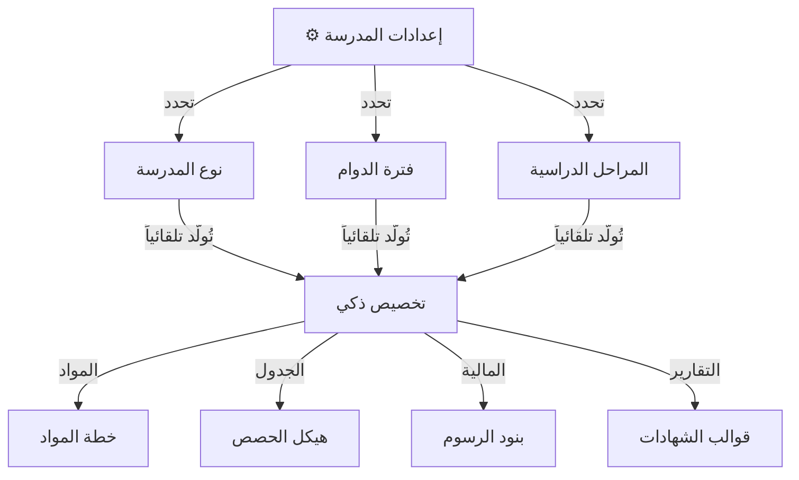
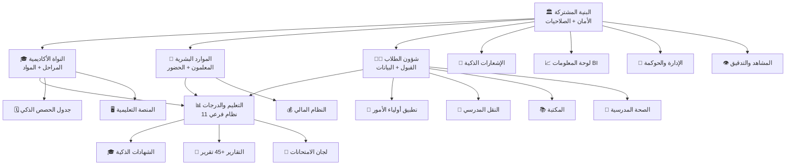

<div dir="rtl">

# 🏫 الخطة التسويقية الاحترافية لنظام إدارة المدرسة المتكامل
## شركة إنما سوفت للحلول التقنية | 2026

---

<div align="center">

### ✨ **"ليس مجرد نظام... بل مدرسة داخل المدرسة"** ✨
### نظام واحد — يحكم كل شيء من الجرس الأول إلى الشهادة الأخيرة

</div>

---

# 📖 الفهرس

1. [المقدمة — لماذا هذا النظام سيُغيّر واقع مدرستكم؟](#-المقدمة)
2. [ما الذي يجعل نظامنا مختلفاً عن أي نظام آخر؟](#-لماذا-نحن-مختلفون)
3. [يدعم كل مدرسة، في أي مكان، بأي نظام](#-مرونة-بلا-حدود)
4. [19 نظاماً ذكياً في منظومة واحدة](#-خريطة-الأنظمة)
5. [جدول الحصص الذكي — المايسترو الرقمي](#-جدول-الحصص-الذكي)
6. [تطبيق أولياء الأمور — المدرسة في الجيب](#-تطبيق-أولياء-الأمور)
7. [الدرجات والنتائج — من شهرين إلى ثوانٍ](#-الدرجات-والنتائج)
8. [تحليل البيانات — اكتشف ما لا تراه العين](#-ذكاء-الأعمال)
9. [البنية التقنية — وداعاً للسيرفرات](#-البنية-التقنية)
10. [لا تشترِ ما لا تحتاج — نظام الوحدات](#-نظام-الوحدات)
11. [مقارنة قبل وبعد — الفرق الصادم](#-قبل-وبعد)
12. [لماذا الآن؟ — الفرصة التي لا تتكرر](#-لماذا-الآن)

---

# 🔥 المقدمة

> **تخيّل هذا المشهد:**
> 
> مدير مدرسة يجلس في مكتبه الساعة 7 صباحاً. يفتح هاتفه، فيرى:
> - 📊 **نسبة حضور اليوم: 94%** — 12 طالب غائب، تم إبلاغ أولياء أمورهم تلقائياً
> - 💰 **تحصيل الشهر: 78%** — 45 طالب لم يسددوا بعد
> - 📈 **تحذير مبكر:** طالبان في الصف التاسع درجاتهما انخفضت 20% هذا الشهر
> - 🔧 **طلب صيانة:** مروحة الصف 3/أ تحتاج إصلاح (أرسله المعلم من جواله)
> 
> **كل هذا قبل أن يحتسي قهوته الصباحية.**
> 
> هذا ليس حلماً. هذا هو نظامنا.

---

### ❌ الواقع المؤلم الذي تعيشه معظم المدارس اليوم:

| المشكلة | كم تكلّف المدرسة؟ |
|---------|-------------------|
| **نتائج الطلاب تستغرق شهراً أو شهرين** لطباعتها، وتُكتشف أخطاء بعد فوات الأوان | هدر وقت + فقدان ثقة |
| **جدول الحصص** يستغرق أسبوعاً أو أكثر، ومع ذلك يكون مليئاً بالتعارضات | فوضى أول أسبوعين |
| **ولي الأمر لا يعرف** أن ابنه غائب أو أن واجبه لم يقدَّم | ضياع تحصيل الطالب |
| **الدفاتر الورقية** تتكدس وتضيع وتنسخ خطأ | لا ذاكرة مؤسسية |
| **سيرفرات بآلاف الدولارات** تقيّد العمل داخل المدرسة فقط | تكلفة + محدودية |
| **لا أحد يعرف السبب الحقيقي** لضعف درجات طالب معين | قرارات عمياء |

> **نظامنا يحل كل هذه المشاكل. ليس بعضها. كلها.**

---

# 💎 لماذا نحن مختلفون؟

## 🧬 الفلسفة التي بُني عليها النظام

لم نبنِ "برنامجاً عادياً". بنينا **عقلاً مدبراً** يفكر، يحلل، ويتخذ القرار قبل أن تطلب منه.

```
┌─────────────────────────────────────────────────────┐
│                                                     │
│   البرامج العادية:  تسجّل → تحفظ → تطبع            │
│                                                     │
│   نظامنا:  يسجّل → يحلل → ينبّه → يقترح → يتعلّم  │
│                                                     │
└─────────────────────────────────────────────────────┘
```

### 🏆 7 أسباب لا تملك أي مدرسة تجاهلها:

| # | الميزة | التأثير |
|---|--------|---------|
| 1 | **19 نظاماً فرعياً متكاملاً** | لا حاجة لشراء 5 برامج مختلفة |
| 2 | **يعمل من أي جهاز وأي مكان** | لا سيرفرات، لا تركيب، لا صيانة |
| 3 | **تطبيق أولياء أمور** مدمج | المدرسة في جيب كل أب وأم |
| 4 | **ذكاء اصطناعي في الجدولة** | جدول حصص مثالي خلال دقائق |
| 5 | **تحليل بيانات متقدم** | اكتشاف أسباب ضعف الطلاب |
| 6 | **نظام وحدات مرن** | اشترِ ما تحتاج فقط |
| 7 | **بنية مؤسسية Enterprise** | لا سقف للتوسع |

---

# 🌍 مرونة بلا حدود

## يدعم أي نوع من المدارس... بدون استثناء

> 🎯 **سؤال واحد نتحداك تجد نظاماً آخر يجيب عليه:**
> هل تستطيع مدرسة **أساسية صباحية أهلية** ومدرسة **ثانوية حكومية مسائية** استخدام نفس النظام؟
> 
> **الجواب عندنا: نعم.**

### 📋 أنواع المدارس المدعومة:

| التصنيف | الأنواع المدعومة |
|---------|-----------------|
| **حسب الملكية** | 🏛️ حكومية · 🏫 أهلية (خاصة) · 🤝 مشتركة |
| **حسب المرحلة** | 🌱 روضة أطفال · 📖 أساسي (1-9) · 🎓 ثانوي · 📚 مختلط (كل المراحل) |
| **حسب الفترة** | ☀️ صباحية · 🌙 مسائية · 🔄 كلاهما · 🕌 رمضاني · ☀️ صيفي |
| **حسب التخصص** | 📐 عامة · 📖 تحفيظ قرآن · 🌐 دولية · ♿ تربية خاصة · 🔧 تقنية |

### 💡 كيف يتكيف النظام؟



> 💬 **يعني بالعربي:** بضغطة زر، تقول للنظام: "أنا مدرسة أساسية أهلية صباحية"، فيتكيف النظام بالكامل — المواد، الجدول، الرسوم، حتى شكل الشهادات — كل شيء يتمحور حول طبيعة مدرستك.

---

# 🗺️ خريطة الأنظمة

## 19 نظاماً ذكياً... منظومة واحدة لا تعرف الفوضى



### 🔢 بالأرقام:

| البند | الرقم |
|-------|-------|
| **الأنظمة الفرعية** | 19 نظاماً |
| **الجداول في قاعدة البيانات** | +150 جدول |
| **التقارير الجاهزة** | +45 تقرير |
| **أنواع الإشعارات** | واتساب + SMS + Push + Email |
| **فريق التطوير** | 6 مهندسين متخصصين |

---

# 🧠 جدول الحصص الذكي

## المايسترو الرقمي الذي يُنهي معاناة "أسبوع الجدول"

> **القصة المألوفة:** كل بداية عام، يقضي وكيل المدرسة أسبوعاً كاملاً أمام لوحة مغناطيسية، يحاول توفيق جداول 30 معلماً مع 20 فصلاً. ينتهي بتعارضات، شكاوى، وأعصاب متوترة.
>
> **مع نظامنا:** دقائق معدودة. صفر تعارضات. الجميع سعيد.

### 🎯 ما يفعله الجدول الذكي ولا يفعله أي جدول آخر:

#### 1. يفهم بيئة المدرسة ويتكيّف معها

| الميزة | كيف تعمل؟ | لماذا مهمة؟ |
|--------|-----------|-------------|
| **تنسيق الشعب** | إذا كان معلم واحد يُدرّس 3 شعب، يضع حصصه في **نفس اليوم** | حتى يُحضّر الدرس مرة واحدة ويُلقيه 3 مرات متتالية، بدل أن يحضّر ليومين مختلفين |
| **أولوية المواد** | الرياضيات والعلوم واللغات في **الحصص الصباحية** | لأن تركيز الطالب في الصباح أعلى بـ 40% |
| **تكرار المواد** | المواد الأساسية يمكن أن تتكرر مرتين في اليوم، لكن الرياضة والرسم **مرة واحدة فقط** | لأن الطالب لا يحتاج حصتي رياضة في يوم |
| **مرونة الحصص** | يدعم 5 أو 6 أو 7 حصص في اليوم | لأن كل مدرسة لها نظامها |

#### 2. يحمي المعلم من الإرهاق

```
❌ بدون النظام:
يوم الأحد: المعلم أحمد = 6 حصص متتالية (منهك!)
يوم الثلاثاء: فارغ بالكامل (إهدار!)

✅ مع النظام:
يوم الأحد: 4 حصص + فراغ + حصة = إيقاع متوازن
يوم الثلاثاء: 3 حصص = عدل وراحة
```

#### 3. محرك محاكاة يمنع الأخطاء

| الخطوة | ما يحدث |
|--------|---------|
| 1. المسودة | تبني جدولاً أولياً |
| 2. المحاكاة | تختبره ضد **آلاف** السيناريوهات |
| 3. التقرير | "وُجدت مشكلتان: معلم في فصلين الساعة 9" |
| 4. الحل | يقترح بديلاً تلقائياً |
| 5. الاعتماد | جدول نظيف 100% |

> 💡 **مثال حقيقي:** المعلم خالد يدرّس عربي لثلاث شعب (7/أ، 7/ب، 7/ج). النظام يضعهم يوم الأحد: الحصة 1، 2، 3 على التوالي. خالد يحضّر درساً واحداً ويكرره 3 مرات. بدل ما يدرّس شعبتين يوم ويرجع للثالثة يوم ثاني ويختلط عليه التحضير.

---

# 📱 تطبيق أولياء الأمور

## المدرسة في جيب كل أب وأم

> **المشكلة الكبرى:** الطالب رجع البيت، أبوه يسأل: "عندك واجب؟" الطالب يقول: "لا." بينما المعلم كتب واجب رياضيات من 10 أسئلة!
>
> **أو:** الطالب غاب يوم كامل... أبوه عرف بعد أسبوع.
>
> **أو:** الطالب ما يقدر يقرأ خط المعلم في الواجب المكتوب على السبورة.
>
> **كل هذا ينتهي مع تطبيقنا.**

### 📲 ما يراه ولي الأمر في التطبيق:

| الخدمة | الوصف | التوقيت |
|--------|-------|---------|
| 📋 **الواجبات** | المعلم يضيف الواجب → يصل لولي الأمر فوراً بنص واضح مكتوب | **لحظي** |
| ⏰ **الغياب** | ابنك لم يحضر الحصة الثانية | **فوري** |
| 📊 **الدرجات** | نتائج الاختبار الشهري بالتفصيل | **أول بأول** |
| 💬 **التواصل** | رسائل مباشرة للمعلم (تحت رقابة الإدارة) | **24/7** |
| 📝 **الاستئذان** | طلب خروج مبكر أو غياب من الجوال | **إلكتروني** |
| 💰 **المالية** | إيصال سداد أو مطالبة بالرسوم | **مباشر** |
| 🎓 **النتائج** | الشهادة الفصلية/النهائية بمجرد اعتمادها | **فوري** |

### 💡 سيناريوهات حقيقية حلّها التطبيق:

#### 🔴 مشكلة الواجبات — قبل وبعد:
```
❌ قبل:
الطالب غاب → ما يعرف الواجب
الطالب ما ركّز → كتب خطأ
الطالب ما يقدر يقرأ خط المعلم → ما حلّ
المعلم نسي يكتب الواجب في الفصل → يضيفه من البيت

✅ بعد:
المعلم يكتب الواجب في التطبيق من أي مكان →
يصل لكل ولي أمر بنص واضح ومقروء →
حتى لو الطالب غائب، أبوه يعرف الواجب
```

#### 🔴 مشكلة النتائج — القصة القديمة:
```
❌ قبل:
آخر اختبار يُصحح → المعلمون يجمعون الدرجات يدوياً →
الكنترول يراجع ويصحح الأخطاء → الطباعة (وفيها أخطاء!) →
المراجعة مرة ثانية → ينتظر المدير التوقيع →
التوزيع بعد شهر أو شهرين ← 😤

✅ بعد:
آخر درجة تُدخل → النظام يحسب تلقائياً →
المدير يضغط "عرض النتائج" →
🔔 إشعار يصل لكل ولي أمر في نفس اللحظة ← 😍
```

### 🛡️ الأمان في التطبيق:
- ✅ كل ولي أمر يرى **أبناءه فقط** — مستحيل يرى بيانات غيره
- ✅ المعلم يرد في **أوقات الدوام** فقط — خصوصية المعلم محفوظة
- ✅ كل رسالة وطلب **موثّق** — لا مجال لـ "ما وصلني شيء"

---

# 📊 الدرجات والنتائج

## من شهرين انتظار... إلى ثوانٍ

### 🎮 محرك الدرجات الذكي — 11 نظاماً فرعياً في خدمة النتيجة:

| النظام الفرعي | ماذا يفعل؟ |
|---------------|------------|
| 1. **سياسات الدرجات** | تحدد أوزان كل عنصر (اختبار 40%، واجبات 20%...) |
| 2. **الاختبارات** | إدارة الفترات ورصد الدرجات |
| 3. **الواجبات المنزلية** | تعريف + رصد التنفيذ لكل طالب |
| 4. **المحصلة الشهرية** | حساب آلي للدرجة الشهرية |
| 5. **نتائج الفصل والعام** | تجميع + ترتيب + قرار النقل |
| 6. **تحضير الدروس** | متابعة جودة التحضير |
| 7. **التدقيق والحوكمة** | قفل الدرجات بعد الاعتماد |
| 8. **التقارير** | +45 تقرير جاهز |
| 9. **النسخ السنوي** | نقل الإعدادات للعام الجديد |
| 10. **الأمثلة التشغيلية** | سيناريو كامل للتدريب |
| 11. **دفتر المتابعة الذكي** | دفاتر متابعة جاهزة للطباعة |

### 🔒 الحوكمة الأكاديمية:

> **لا يمكن لأحد التلاعب بالدرجات.** النظام يسجل من عدّل ماذا ومتى.

```
المعلم أحمد → عدّل درجة الطالب محمد من 90 إلى 50
⏰ السبت الساعة 10:00 صباحاً
🖥️ من جهاز IP: 192.168.1.50
📝 السبب: [يجب كتابة السبب]
🔔 إشعار → المدير
```

---

# 🧠 ذكاء الأعمال

## اكتشف ما لا تراه العين — لوحة معلومات (BI) لصنع القرار

### 🔮 مثال حقيقي لقوة تحليل البيانات:

> **سؤال المدير:** "لماذا درجات الصف السابع/أ ضعيفة في الرياضيات؟"
>
> **جواب النظام:**
>
> | العامل | النتيجة |
> |--------|---------|
> | 70% من طلاب الفصل | أولياء أمورهم مغتربون |
> | 45% من الأمهات | مستوى تعليم أقل من ثانوي |
> | الفصول ذات أمهات جامعيات | تفوقت بنسبة 30% |
>
> **القرار:** تنظيم دورات تقوية مسائية لهذا الفصل + تواصل مع الأخوال/الجيران

### 📈 المؤشرات الحية على لوحة المدير:

| المؤشر | ماذا يقيس؟ | اللون |
|--------|-----------|-------|
| 🟢 **نسبة الحضور** | حضور اليوم مقارنة بالمتوسط | أخضر > 90% |
| 🟡 **التحصيل المالي** | نسبة ما تم تحصيله من الرسوم | أصفر 60-80% |
| 🔴 **الطلاب المعرضون للفشل** | من انخفضت درجاتهم 3 أشهر متتالية | أحمر = تدخل فوري |
| 🟢 **تفاعل أولياء الأمور** | من يقرأ الرسائل ومن يتجاهلها | نسبة القراءة |
| 🟡 **كفاءة المعلمين** | ربط أحمال المعلمين بنتائج طلابهم | تحليل الفعالية |

### 🎯 مصفوفة التنبؤ بالمخاطر (Risk Matrix):

يحسب النظام **درجة خطر** لكل طالب من 3 محاور:

```
درجة الخطر = (الخطر الأكاديمي × 40%) + (الخطر السلوكي × 30%) + (خطر الغياب × 30%)

إذا تجاوزت 70% → 🚨 تنبيه فوري للمرشد والمدير
```

---

# ☁️ البنية التقنية

## وداعاً للسيرفرات... مرحباً بالحرية

### 💸 المقارنة المالية الصادقة:

| البند | الطريقة التقليدية (سيرفر محلي) | نظامنا (سحابي) |
|-------|-------------------------------|----------------|
| **تكلفة الأجهزة** | 3,000 - 10,000 دولار للسيرفر | **0 دولار** |
| **الصيانة السنوية** | 500 - 2,000 دولار | **مشمولة** |
| **فني تقنية معلومات** | راتب شهري مستمر | **لا يحتاج** |
| **التوسع** | شراء سيرفر جديد! | **بضغطة زر** |
| **مكان العمل** | داخل المدرسة فقط | **أي مكان في العالم** |
| **الأعطال** | توقف كامل لحين الإصلاح | **تشغيل 99.9%** |
| **النسخ الاحتياطي** | يدوي (وغالباً منسي) | **تلقائي كل ساعة** |

### 📱 يعمل على كل شيء:

```
✅ كمبيوتر مكتبي    ✅ لابتوب    ✅ آيباد / تابلت    ✅ جوال أندرويد    ✅ آيفون
```

> 💡 **يعني:** المعلم يدخل الدرجات من جواله وهو في البيت. المدير يتابع من جهازه اللوحي في اجتماع خارجي. ولي الأمر يتابع ابنه من هاتفه في العمل.

### 🔐 الأمان:

| الطبقة | الحماية |
|--------|---------|
| **تشفير البيانات** | بروتوكول SSL/TLS — نفس مستوى البنوك |
| **صلاحيات دقيقة** | المعلم يرى طلابه فقط، المحاسب يرى المالية فقط |
| **سجل تدقيق** | "الصندوق الأسود" — يسجل كل حركة |
| **قفل الدرجات** | بعد الاعتماد، لا يمكن تعديل أي درجة |

---

# 🧩 نظام الوحدات

## لا تشترِ ما لا تحتاج — خذ ما يناسبك فقط

> 🎯 **فلسفتنا:** مش كل مدرسة تحتاج كل شيء. روضة أطفال لا تحتاج نظام لجان امتحانات. مدرسة صغيرة قد لا تحتاج نظام نقل. ولذلك...

### 📦 الوحدات المتاحة:

| الحزمة | ماذا تشمل؟ | مناسبة لـ |
|--------|-----------|----------|
| 🥉 **الأساسية** | البنية المشتركة + النواة + الطلاب + الدرجات | أي مدرسة |
| 🥈 **المتقدمة** | الأساسية + المالية + التقارير + الشهادات | المدارس الأهلية |
| 🥇 **الاحترافية** | المتقدمة + الجدول الذكي + تطبيق أولياء الأمور + الإشعارات | المدارس الطموحة |
| 💎 **الكاملة** | جميع الـ 19 نظاماً | المجمعات التعليمية الكبرى |

> ✨ **الجميل:** يمكنك البدء بالحزمة الأساسية، ثم إضافة أي نظام لاحقاً **بدون فقدان أي بيانات**.

---

# ⚡ قبل وبعد

## الفرق الذي سيصدم كل من رآه

| العملية | ❌ قبل النظام | ✅ بعد النظام |
|---------|-------------|-------------|
| **إعداد جدول الحصص** | أسبوع + فريق + تعارضات | **دقائق** + صفر أخطاء |
| **طباعة نتائج الطلاب** | شهر إلى شهرين + أخطاء | **ثوانٍ** — بمجرد اعتماد آخر درجة |
| **إبلاغ ولي الأمر بالغياب** | يوم واحد... أو أبداً | **لحظي** — واتساب/تطبيق |
| **معرفة واجب اليوم** | يعتمد على الطالب (قد يكذب!) | **تلقائي** — يصل لولي الأمر |
| **استخراج تقرير مالي** | ساعات من البحث في الدفاتر | **ثوانٍ** من أي جهاز |
| **تقييم أداء المعلمين** | رأي شخصي | **أرقام ومؤشرات** دقيقة |
| **معرفة سبب ضعف طالب** | تخمين | **تحليل بيانات** حقيقي |
| **إصدار الشهادات** | أسابيع + خطاط | **دقائق** + تشفير QR |
| **إدارة لجان الامتحانات** | أسبوع يدوي | **ضغطة زر** واحدة |
| **متابعة المعلم في البيت** | مستحيل — الجهاز في المدرسة | **تعمل من أي مكان** |

---

# 🚀 التقارير والكشوفات

## +45 تقرير جاهز — محرك ذكي يفهم ما تريد

### 📝 أمثلة من التقارير المتاحة:

| القسم | التقرير | الفائدة |
|-------|---------|---------|
| 🧑‍🎓 **الطلاب** | كشف الطلاب · سجل القيد · تقرير الأعمار · بيانات الاتصال | إدارة ملفات كاملة |
| 📊 **الأكاديمي** | الشهادة المدرسية · إشعار شهري · قائمة الأوائل · تقرير الراسبين | متابعة دقيقة |
| 💰 **المالي** | كشف المتأخرين · الإيراد اليومي · المصروفات · الميزانية | شفافية كاملة |
| 👥 **الموظفون** | مسير الرواتب · سجل الحضور · نصاب المعلمين | عدالة وظيفية |
| 🚌 **النقل** | قوائم الركاب · الاشتراكات · تكاليف الصيانة | كفاءة تشغيلية |

### 🎛️ فلترة ذكية سياقية:
> النظام يعرف **سياق** التقرير ويعرض فلاتر مناسبة فقط. مثلاً: عند اختيار "التقرير المالي"، يظهر فلتر "المبلغ المتبقي"، وعند "تقرير الغياب"، يظهر فلتر "نطاق التاريخ".

---

# ⏰ لماذا الآن؟

## الفرصة التي لا تتكرر

### 🌊 العالم يتغير:
- المدارس المنافسة بدأت تتحول رقمياً
- أولياء الأمور يطالبون بالشفافية والتطبيقات
- الوزارات تتجه للحكومة الإلكترونية
- التحول الرقمي لم يعد ترفاً — بل **شرط بقاء**

### 🏆 ماذا ستكسب المدرسة؟

| المكسب | القيمة |
|--------|--------|
| **ثقة أولياء الأمور** | يرون كل شيء بأنفسهم = رضا وولاء |
| **سمعة احترافية** | مدرسة بتطبيق خاص = تميّز في السوق |
| **توفير مالي** | لا سيرفرات + لا فنيين + لا ورق |
| **كفاءة إدارية** | قرارات مبنية على بيانات لا تخمينات |
| **جاهزية للتوسع** | فرع جديد؟ شعبة جديدة؟ يتسع بضغطة |

---

<div align="center">

## 📞 تواصل معنا الآن

### **شركة إنما سوفت للحلول التقنية**
### *نبني مستقبل التعليم... نظام واحد في كل مرة*

---

> 💬 *"لا تبحث عن نظام يعمل. ابحث عن نظام يفكر."*
> 
> **— فريق إنما سوفت**

</div>

---

### 📌 ملاحظة أخيرة:
> هذه الوثيقة تم إعدادها بناءً على تحليل شامل لـ **19 نظاماً فرعياً** يحتوي على أكثر من **150 جدول بيانات** و**+45 تقريراً جاهزاً**، صُمم وطُوّر بواسطة فريق من **6 مهندسين** متخصصين. كل ميزة ذُكرت في هذه الوثيقة **موجودة فعلياً** في النظام ومدعومة بقاعدة بيانات جاهزة للتشغيل.

</div>
